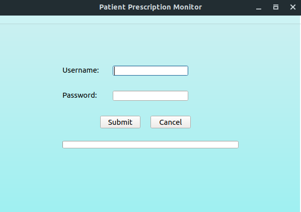

# Patient Presciption Monitor
Download patient prescription data from the [arkansas pmp database](https://arkansaspmp.com) for all your patients

* PyQt5
* Pandas
* Requests
* Selenium
## Prerequisites

You can install all of them at once by cloning the repo and running

`pip install -r requirements.txt`

## Download

Download the latest release [here](https://github.com/katzrkool/patientPrescriptionMonitor/releases)

## Usage

Once you have downloaded the application, open it and a window like this should appear

Enter your Arkansas pmp username and password. 

The program figures out what patients to fetch via csv file. A new window should appear asking for that csv file. If you have one, select it.

Then it'll ask you where to save your data. Pick a folder somewhere or make a new one (Reccomended).

If your account is a subaccount, it'll ask you which master account to use.

It'll then download all of your patient's prescription history. When the progress bar is full and text on the screen says Finished, you can close the app. All the data will be in the folder you selected. Enjoy!